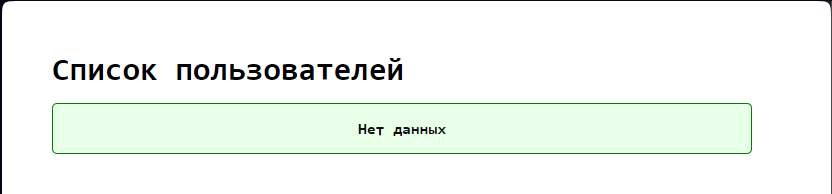
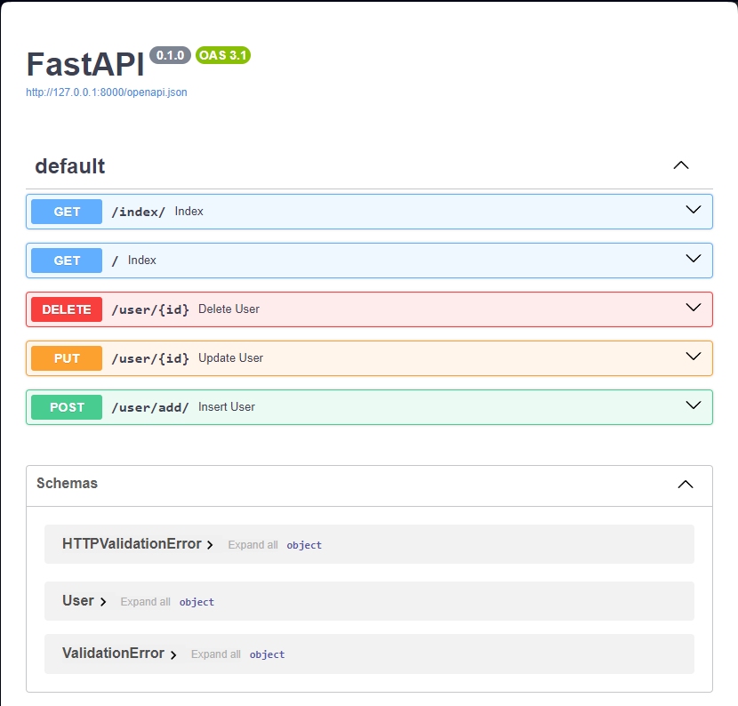
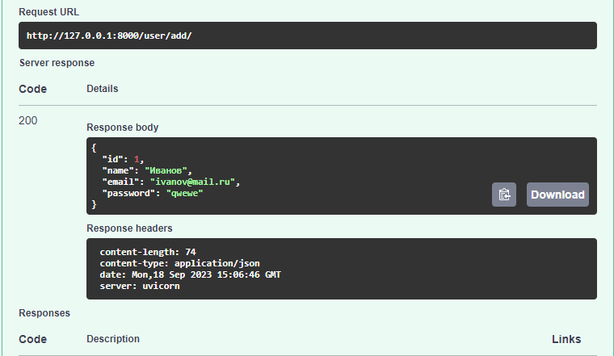

# Фреймворки Flask и FastAPI

## Задание 3

Доработаем задача про студентов
- Создать базу данных для хранения информации о студентах и их оценках в учебном заведении.
- База данных должна содержать две таблицы: "Студенты" и "Оценки".
- В таблице "Студенты" должны быть следующие поля: id, имя, фамилия, группа и email.
- В таблице "Оценки" должны быть следующие поля: id, id студента, название предмета и оценка.
- Необходимо создать связь между таблицами "Студенты" и "Оценки".
- Написать функцию-обработчик, которая будет выводить список всех студентов с указанием их оценок.

**пример выполнения**

## Задание 8

Задание №8
 - Создать форму для регистрации пользователей на сайте.
 - Форма должна содержать поля "Имя", "Фамилия", "Email", "Пароль" и кнопку "Зарегистрироваться".
 - При отправке формы данные должны сохраняться в базе данных, а пароль должен быть зашифрован.

пример выполнения

