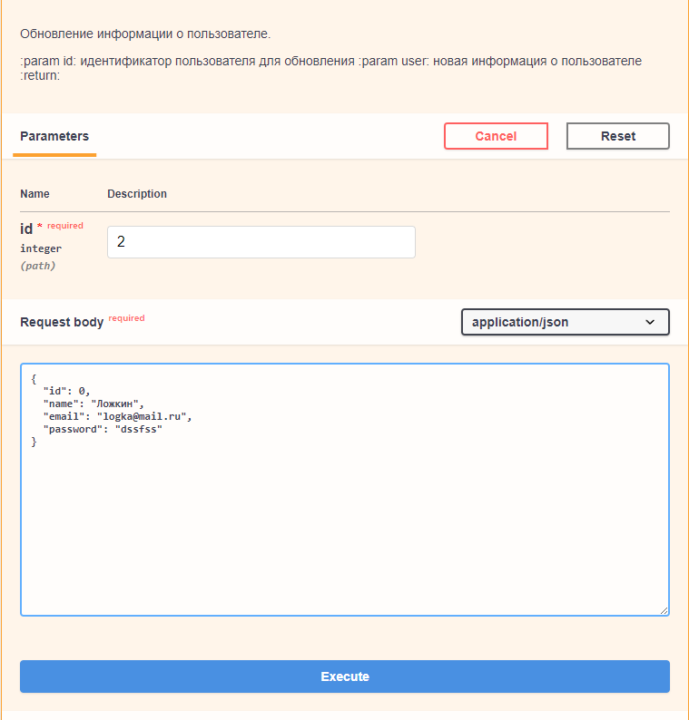

# Фреймворки Flask и FastAPI

Выполнить задания 3, 4, 5, 6 презентации в виде одного приложения.

Задание №3
- Создать API для добавления нового пользователя в базу данных. Приложение
- должно иметь возможность принимать POST запросы с данными нового пользователя и сохранять их в базу данных.
- Создайте модуль приложения и настройте сервер и маршрутизацию.
- Создайте класс User с полями id, name, email и password.
- Создайте список users для хранения пользователей.
- Создайте маршрут для добавления нового пользователя (метод POST).
- Реализуйте валидацию данных запроса и ответа.

Задание №4
Создать API для обновления информации о пользователе в базе данных.
Приложение должно иметь возможность принимать PUT запросы с данными пользователей и обновлять их в базе данных.
- Создайте модуль приложения и настройте сервер и маршрутизацию.
- Создайте класс User с полями id, name, email и password.
- Создайте список users для хранения пользователей.
- Создайте маршрут для обновления информации о пользователе (метод PUT).
- Реализуйте валидацию данных запроса и ответа.

Задание №5
Создать API для удаления информации о пользователе из базы данных.
- Приложение должно иметь возможность принимать DELETE запросы и удалять информацию о пользователе из базы данных.
- Создайте модуль приложения и настройте сервер и маршрутизацию.
- Создайте класс User с полями id, name, email и password.
- Создайте список users для хранения пользователей.
- Создайте маршрут для удаления информации о пользователе (метод DELETE).
- Реализуйте проверку наличия пользователя в списке и удаление его из списка.

Задание №6
- Создать веб-страницу для отображения списка пользователей. Приложение должно использовать шаблонизатор Jinja для динамического формирования HTML страницы.
- Создайте модуль приложения и настройте сервер и маршрутизацию.
- Создайте класс User с полями id, name, email и password.
- Создайте список users для хранения пользователей.
- Создайте HTML шаблон для отображения списка пользователей. Шаблон должен содержать заголовок страницы, таблицу со списком пользователей и кнопку для добавления нового пользователя.
- Создайте маршрут для отображения списка пользователей (метод GET).
- Реализуйте вывод списка пользователей через шаблонизатор Jinja.

**Пример выполнения**

